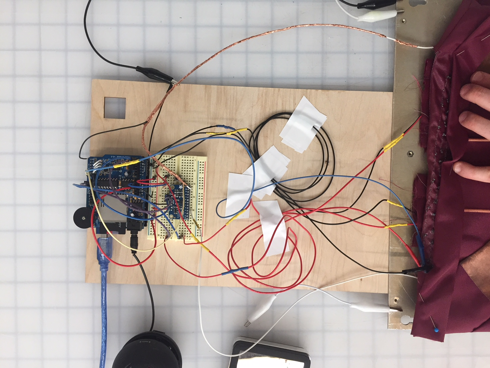
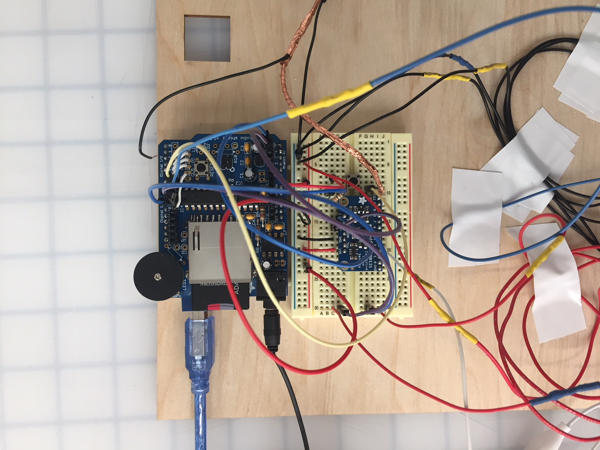

# Wearable Therapy

## An interactive mat encouraging young pianists to engage in ulnar and radial deviation, a wrist physical therapy stretch intended to prevent arthritis and to develop suppleness of the wrist joint for optimal piano playing.

### Project goal: 
Using capacitive touch, light, sound, and haptic feedback, develop a delightful interaction that motivates users to execute their physical therapy regimen. Feedback should be readily understandable, and help users understand where they are in the process of completing their exercises. 

### Parts List: 
Arduino UNO, AdaFruit WaveShield, AdaFruit MPR121 Capacitive Touch Breakout Board, 2 vibration motors, copper conductive fabric, pushbutton, 8 NeoPixels, plug-in speaker, powerbank

Having multiple feedback modalities was key here, in order to guide users through the direction and duration of each stretch, as well as the completion of a full round of stretching. I utilized the WaveShield in order to enable more complex sounds for the different feedback I needed to provide: right side touched, wrong side touched, completion/on/off.  I used the capacitive touch breakout board to accommodate more pins, since the WaveShield takes up many of them. Capacitive touch was certainly buggy, and the conductive fabric, used as a sensor, required a lot of grounding to make it stable, and produce a sound only when touched. I experimented with different ways of doing this, including wrapping the wires connecting the sensors with copper tape and grounding that, as well as adding alligator clips and connecting them to a grounded metal plate.  The neopixels were a good fit because they are chainable, and thus made coding sequential countdowns and flashing relatively simple. 

 
