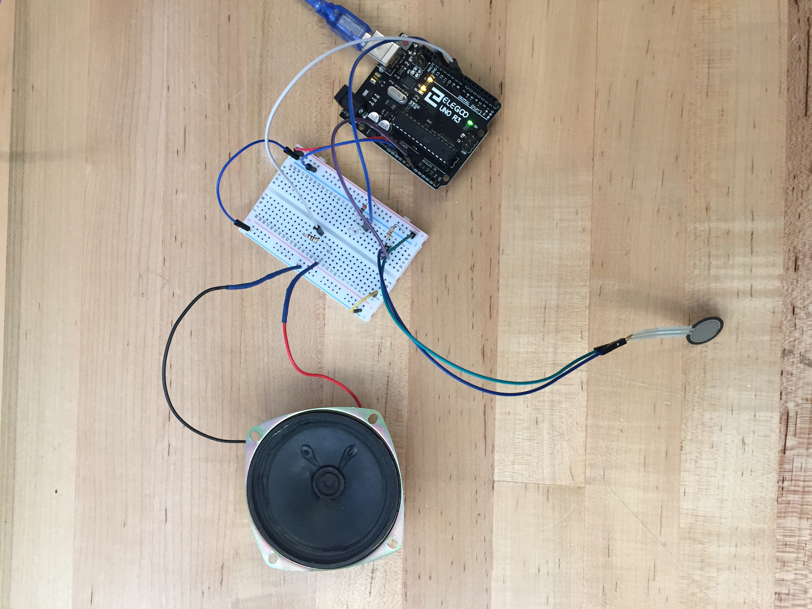
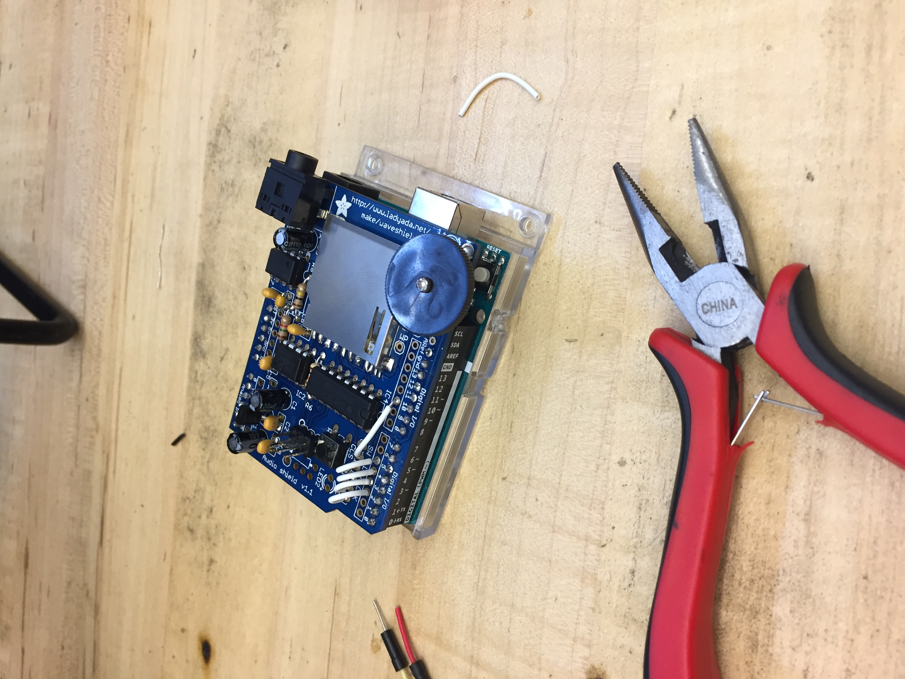

# Midterm Project Documentation

## Teach Me to Relate

### Concept: Create a wearable garment that plays stories based on location-specific touch
The basic functionality of the garment includes having a a force sensitive resistor read pressure (touch), and translating that into an audio tone, as well as lighting up an LED. 

### V1.0: Tone Keyboard + light up an LED
I followed instructions and used code that I found for a Tone Keyboard, using just one FSR instead of three: https://www.arduino.cc/en/Tutorial/toneKeyboard

With the help of the kind folks at the Hybrid Lab, I adapted the tone keyboard code to include lighting up an LED when the FSR is pressed. This included adding a boolean statement, and putting both the tone generation and the LED illumination into an if statement, so that both would happen concurrently when the FSR threshold was reached. 

See it in action here: https://vimeo.com/259165555

### V1.1: Wave Shield + Audio File
Since the ultimate goal is to generate specific sound clips when an FSR is touched, the next step was to figure out how to go from a simple tone generation to the playback of a sound file. I assembled a Wave Shield, which can play .wav files off of an SD card, following this comprehensive tutorial: https://cdn-learn.adafruit.com/downloads/pdf/adafruit-wave-shield-audio-shield-for-arduino.pdf. 

I then found a sound file I liked (Cry to Me by Solomon Burke, a trusty classic!), and converted it to the wave shield's specifications of 16 bit, 22,050 kHz, mono. I loaded the track onto the SD card.

The next step was initializing the SD card, and finding the right code to make the audio file play. The challenge was to get the wave shield to play a specific track on the SD card, and not just cycle through all of the tracks stored on it. The key was using the PlayComplete function to specify a specific track on the SD card. Sudhu helped me debug this to see in the serial monitor when the specified track was playing. 

